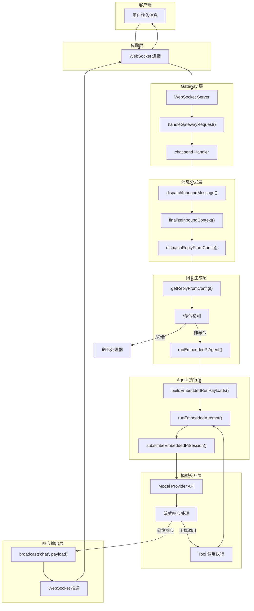
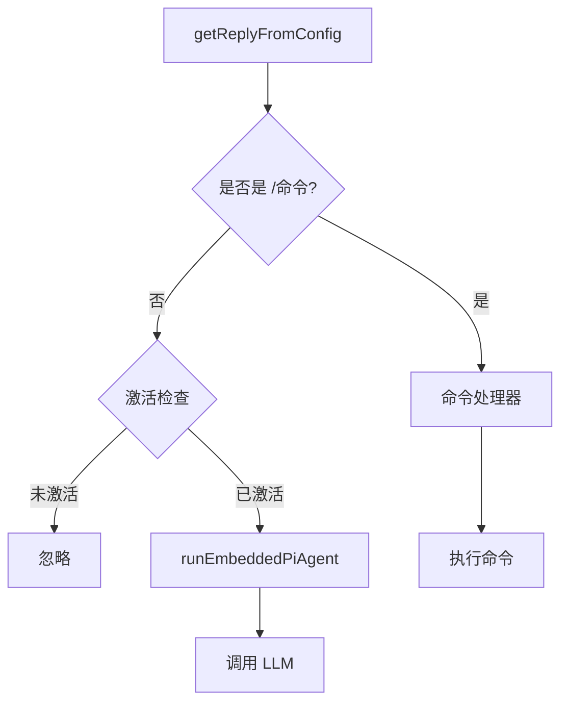
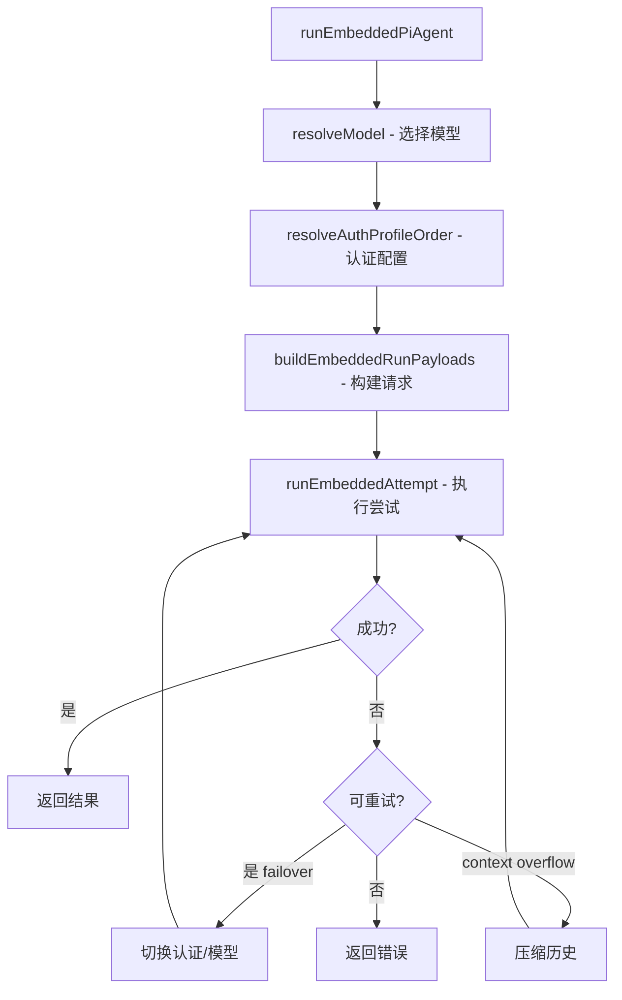
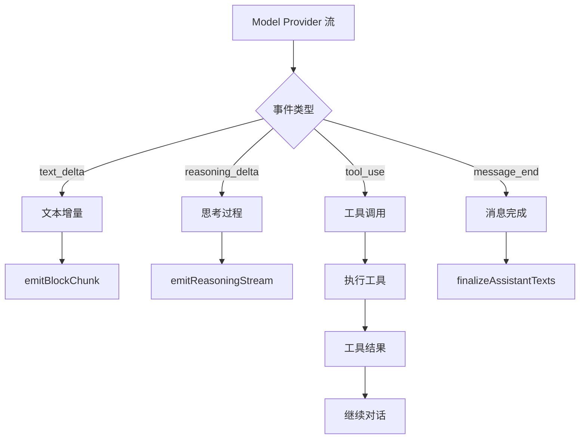

# OpenClaw 用户消息处理流程架构

本文档描述了当用户通过 WebChat 发送消息时，OpenClaw 服务端如何处理请求的完整流程。

## 整体流程图



## 详细节点说明

### 1. 传输层

| 文件                                                                      | 功能                                   |
| ------------------------------------------------------------------------- | -------------------------------------- |
| [server-http.ts](file:///opt/yi/claw/openclaw/src/gateway/server-http.ts) | HTTP/HTTPS 服务器，处理 WebSocket 升级 |
| [client.ts](file:///opt/yi/claw/openclaw/src/gateway/client.ts)           | WebSocket 客户端实现                   |

- **协议**: WebSocket (`ws://` 或 `wss://`)
- **默认端口**: `18789`
- **消息格式**: JSON 帧（RequestFrame / ResponseFrame / EventFrame）

---

### 2. Gateway 请求路由

| 文件                                                                            | 函数                     |
| ------------------------------------------------------------------------------- | ------------------------ |
| [server-methods.ts](file:///opt/yi/claw/openclaw/src/gateway/server-methods.ts) | `handleGatewayRequest()` |

核心路由逻辑：

```typescript
// 1. 权限检查
const authError = authorizeGatewayMethod(req.method, client);

// 2. 查找对应 handler
const handler = coreGatewayHandlers[req.method];

// 3. 调用 handler
await handler({ req, params, client, respond, context });
```

聊天相关方法：

- `chat.send` - 发送消息
- `chat.history` - 获取历史
- `chat.abort` - 中止会话

---

### 3. Chat.Send Handler

| 文件                                                                            | 函数                        |
| ------------------------------------------------------------------------------- | --------------------------- |
| [chat.ts](file:///opt/yi/claw/openclaw/src/gateway/server-methods/chat.ts#L302) | `chatHandlers["chat.send"]` |

关键步骤：

1. **参数验证** - 验证 `sessionKey`, `message`, `attachments` 等
2. **附件处理** - 解析图片等多媒体内容
3. **策略检查** - `resolveSendPolicy()` 决定是否允许发送
4. **停止命令检测** - 检测 `/stop` 等特殊命令
5. **去重检查** - 基于 `idempotencyKey` 防重复
6. **创建 AbortController** - 支持中止运行
7. **构建消息上下文** - 创建 `MsgContext` 对象
8. **分发消息** - 调用 `dispatchInboundMessage()`

---

### 4. 消息分发层

| 文件                                                                                                 | 函数                        |
| ---------------------------------------------------------------------------------------------------- | --------------------------- |
| [dispatch.ts](file:///opt/yi/claw/openclaw/src/auto-reply/dispatch.ts)                               | `dispatchInboundMessage()`  |
| [dispatch-from-config.ts](file:///opt/yi/claw/openclaw/src/auto-reply/reply/dispatch-from-config.ts) | `dispatchReplyFromConfig()` |

职责：

- 标准化入站消息上下文（`finalizeInboundContext`）
- 调用回复生成器（`getReplyFromConfig`）
- 处理多回复分发
- 管理 TTS 自动转换
- 处理路由到其他渠道

---

### 5. 回复生成层

| 文件                                                                           | 函数                   |
| ------------------------------------------------------------------------------ | ---------------------- |
| [get-reply.ts](file:///opt/yi/claw/openclaw/src/auto-reply/reply/get-reply.ts) | `getReplyFromConfig()` |

这是核心决策点，决定如何处理消息：



主要分支：

1. **斜杠命令** (`/status`, `/model`, `/think` 等) → 命令处理器
2. **普通消息** → 嵌入式 Agent 执行

---

### 6. Agent 执行层

| 文件                                                                                         | 函数                           |
| -------------------------------------------------------------------------------------------- | ------------------------------ |
| [run.ts](file:///opt/yi/claw/openclaw/src/agents/pi-embedded-runner/run.ts)                  | `runEmbeddedPiAgent()`         |
| [attempt.ts](file:///opt/yi/claw/openclaw/src/agents/pi-embedded-runner/run/attempt.ts)      | `runEmbeddedAttempt()`         |
| [pi-embedded-subscribe.ts](file:///opt/yi/claw/openclaw/src/agents/pi-embedded-subscribe.ts) | `subscribeEmbeddedPiSession()` |

执行流程：



**重试机制**：

- **Auth Profile Failover** - 在多个 API Key 之间切换
- **Model Failover** - 在备用模型之间切换
- **Context Compaction** - 上下文溢出时压缩历史

---

### 7. 流式响应处理

| 文件                                                                                         | 函数                           |
| -------------------------------------------------------------------------------------------- | ------------------------------ |
| [pi-embedded-subscribe.ts](file:///opt/yi/claw/openclaw/src/agents/pi-embedded-subscribe.ts) | `subscribeEmbeddedPiSession()` |

处理来自 LLM 的流式事件：



**主要事件**：

- `text_delta` - 文本流式输出
- `reasoning_delta` - 推理过程（thinking）
- `tool_use` - 工具调用请求
- `tool_result` - 工具执行结果
- `message_end` - 消息完成

---

### 8. 响应广播

通过 WebSocket 将响应推送给客户端：

```typescript
// 增量更新
context.broadcast("chat", {
  runId,
  sessionKey,
  seq,
  state: "delta",
  text: deltaText,
});

// 最终消息
context.broadcast("chat", {
  runId,
  sessionKey,
  seq,
  state: "final",
  message: messageBody,
});
```

---

## 关键数据结构

### MsgContext（消息上下文）

```typescript
interface MsgContext {
  Body: string; // 原始消息
  BodyForAgent: string; // 带时间戳的消息（给 Agent）
  SessionKey: string; // 会话标识
  Provider: string; // 消息来源渠道
  ChatType: string; // 聊天类型
  CommandAuthorized: boolean;
  // ... 更多字段
}
```

### ReplyPayload（回复载荷）

```typescript
interface ReplyPayload {
  text?: string;
  media?: MediaContent[];
  isSystemMessage?: boolean;
  // ... 更多字段
}
```

---

## 与 LangGraph 的对比

| LangGraph 概念   | OpenClaw 对应                                 |
| ---------------- | --------------------------------------------- |
| Node（节点）     | 各个处理函数（handler, dispatcher, runner）   |
| Edge（边）       | 函数调用链                                    |
| State（状态）    | `MsgContext`, `SessionEntry`, 会话 transcript |
| Conditional Edge | `if` 分支（如命令检测、激活检查）             |
| Cycle（循环）    | Tool 执行循环、Failover 重试                  |

主要区别：

- OpenClaw 使用**函数调用链**而非显式图结构
- 状态管理分散在各层（而非统一的 State 对象）
- 通过 **EventEmitter** 和 **Callback** 实现事件驱动
